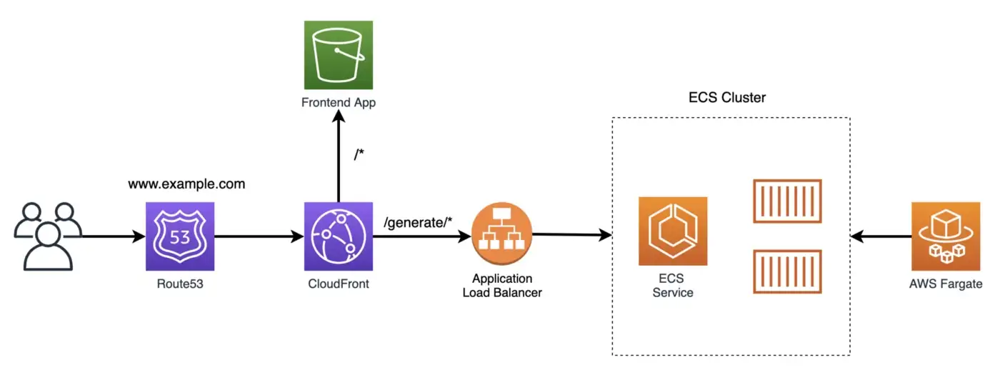

# CDK Playground
Simple Fibonacci generator ⚙️. To grasp how to deploy a real world app to aws via aws cdk for typescript

The frontend react application will provide input for the users to enter the desired Fibonacci number and the backend REST API will return the value for the requested number. Trying to build a scalable architecture for this app where hundreds of users start requesting Fibonacci numbers ✨. Using aws `Fargate` and an `ECS` cluster to containerize the backend service and `Cloudfront` as a cdn to serve static files with `Route 53` for dns mapping.

The `cdk.json` file tells the CDK Toolkit how to execute your app.

## Useful commands

* `npm run build`   compile typescript to js
* `npm run watch`   watch for changes and compile
* `npm run test`    perform the jest unit tests
* `cdk deploy`      deploy this stack to your default AWS account/region
* `cdk diff`        compare deployed stack with current state
* `cdk synth`       emits the synthesized CloudFormation template

